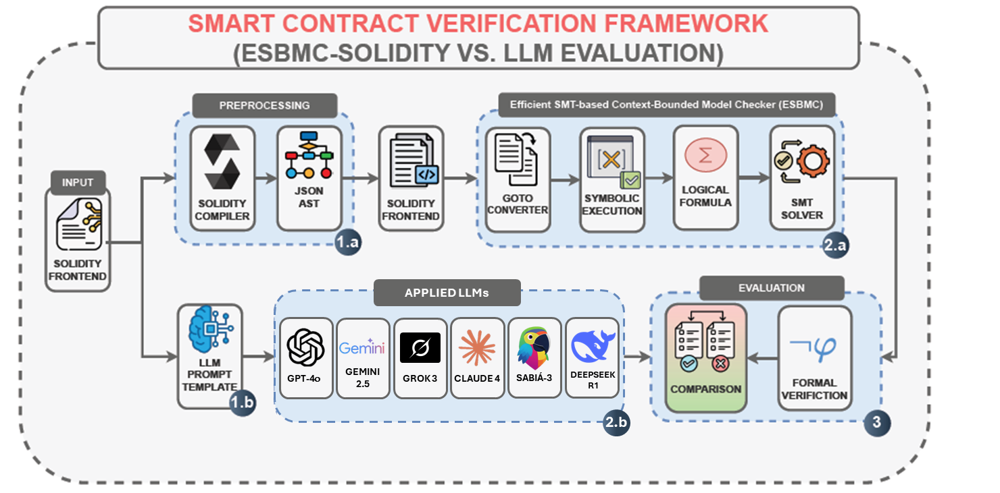

# Comparative Evaluation of Large Language Models and ESBMC-Solidity for Smart Contract Verification

## 1. Description

**LLMContractBench** is a benchmark for smart contract vulnerability detection, comparing **Large Language Models (LLMs)** with the formal verification tool **ESBMC-Solidity**.  

As Ethereum smart contracts secure billions of dollars in assets, reliable vulnerability detection becomes critical.  
- Formal verification tools like ESBMC-Solidity provide **deterministic guarantees** but struggle with semantic and business logic flaws.  
- LLMs excel at **contextual and semantic reasoning**, but may introduce false positives and inconsistencies.  

This repository provides:  
- A curated dataset of **50 real-world Solidity contracts** (from the ScrawlD dataset) annotated with ground-truth vulnerabilities.  
- Standardized **prompt templates** for querying LLMs.  
- Python **scripts** for running experiments and merging outputs.  
- Evaluation **results** for ESBMC-Solidity and multiple state-of-the-art LLMs.  

The benchmark highlights their **complementary strengths** and supports research on **hybrid verification frameworks**.

---

## 2. Framework

The framework for LLMContractBench integrates **formal verification** with **LLM-based auditing**, as illustrated below:

  

---

## 3. Dataset

The dataset consists of 50 real-world Ethereum smart contracts annotated across **eight vulnerability categories**:

- **ARTHM** – Arithmetic errors  
- **DOS** – Denial of Service  
- **LE** – Logical Errors  
- **RENT** – Reentrancy  
- **TM** – Time Manipulation  
- **TOO** – Incorrect Time Usage  
- **TXO** – Insecure use of tx.origin  
- **UE** – Unchecked External Calls  

📂 Dataset: [`dataset/SWC50-dataset.json`](dataset/SWC50-dataset.json)

---

## 4. Prompts

We provide standardized prompt templates used to query LLMs for vulnerability detection.  

📂 Prompt file: [`prompts/PROMPT.txt`](prompts/PROMPT.txt)

---

## 5. Scripts for Reproducing Research

- **[1_LLM-test-OPENROUTER.py](scripts/1_LLM-test-OPENROUTER.py)**  
  Runs evaluation of contracts with different LLMs via OpenRouter.  

## 6. Results

We provide results for **ESBMC-Solidity** and multiple LLMs, including:
- GPT-4o  
- Google Gemini 2.5-Pro  
- DeepSeek-R1  
- CodeLLaMA-7B-Instruct (Solidity)  
- ESBMC-Solidity 7.9  

Metrics reported:
- **Precision, Recall, F1-score** (per vulnerability category)
- **Exact Match Accuracy (EMA)**
- **At Least One Correct (ONE)**

📂 All outputs are available in the [`results/`](results/) folder.

### Available result files
- [esbmc_7.9_results.csv](results/esbmc_7.9_results.csv)  
- [openai_gpt-4o_results.csv](results/openai_gpt-4o_results.csv)  
- [google_gemini-2.5-pro_results.csv](results/google_gemini-2.5-pro_results.csv)  
- [deepseek_deepseek-chat-v3.1_results.csv](results/deepseek_deepseek-chat-v3.1_results.csv)  
- [alfredpros_codellama-7b-instruct-solidity_results.csv](results/alfredpros_codellama-7b-instruct-solidity_results.csv)  
- [google_gemini-2.5-flash-lite_results.csv](results/google_gemini-2.5-flash-lite_results.csv)  
- [openai_gpt-5-codex_results.csv](results/openai_gpt-5-codex_results.csv)  

